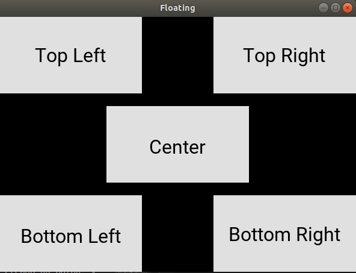

# Guía Kivy

Python renderiza las cosas en opengl, con lo cual da un aspecto uniforme en distintas plataformas. Por tanto, no usa componentes nativos.

## 1. Programa básico
La estructura básica de un programa en kivy es la siguiente:

```python
import kivy
kivy.require("1.10.1")

from kivy.app import App
from kivy.uix.button import Label


class HelloKivy(App):
    
    def build(self):
        return Label(text="Hola Mundo")

helloKivy = HelloKivy()

helloKivy.run()
```

Básicamente, toda aplicación se basa en una clase que nos creamos, que hereda de **kivy.app.App** . Además, es necesario redefinir el método build, que debe retornar un widget (un widget puede ser un elemento de interfaz (botón, etiqueta,...) o un layout (Que es lo más normal)).

### 1.1. Separación lógica-presentación
Se puede separar la capa de presentación usando un fichero con extensión .kv. Para ello, renombramos la clase *HelloKivy* a ***HelloKivyApp***, ya que kivy busca automáticamente un fichero kv con el nombre de la clase sin el sufijo *App* y en minúscula. En nuestro caso, hellokivy.kv.

Tras las modificaciones, se quedaría todo así:
**tutorial.py** (Código del programa)
```python
import kivy
kivy.require('1.10.1')
from kivy.app import App
from kivy.uix.button import Label


class HelloKivyApp(App):
    
    def build(self):
        return Label()

helloKivy = HelloKivyApp()

helloKivy.run()
```

**hellokivy.kv**
```yaml
#:kivy 1.10.1
<Label>:
    text: "Hello Kivy"
```


# 2. Layouts
Los layouts son widgets especiales cuyo propósito es contener otros widgets como botones, etiquetas, campos de texto, y permitir organizarlos por la ventana. 

Existen varios layouts que organizan sus componentes hijos de distintas maneras, y que podemos usar dependiendo de las características que tenga la aplicación que vayamos a desarrollar.

**Widget** es la clase base para todos los layouts y widgets en general. A continuación, mostramos un ejemplo de aplicación muy simple que vamos a utilizar como punto de partida para ver el resto de layouts:

**widgetlayoutapp.py**
```python
import kivy
kivy.require("1.10.1")

from kivy.app import App
from kivy.uix.widget import Widget

class CustomWidget(Widget):
    pass

class CustomWidgetApp(App):

    def build(self):
        return CustomWidget()

customWidget = CustomWidgetApp()
customWidget.run()
```
**customwidget.kv**
```yaml
#:kivy 1.10.1
<CustButton@Button>:
    font_size:  32
    color:  0, 0, 0, 1
    size: 150, 50
    background_normal: ''
    background_down: 'bkgrd-down-color.png'
    background_color: .88, .88, .88, 1

<CustomWidget>:
    CustButton:
        text: "Random"
        pos: root.x, 200

    CustButton:
        text: "Buttons"
        pos: 200, root.y
    
    CustButton:
        text: "Random"
        pos: 200, 400
```
En el kv anterior, hemos definido un tipo de botón basado en *Button*, al que hemos llamado *CustButton*. Luego, hemos puesto 3 botones de tipo *CustButton* en nuestro Widget *CustomWidget*.

El resultado sería el siguiente:


## 2.1. BoxLayout
Organiza los widgets de manera adyacente, en disposición horizontal (de izquierda a derecha) o vertical (de arriba a abajo). 


La propiedad ***size_hint*** de los hijos puede usarse para cambiar las proporciones de cada hijo.

Ejemplo: 
***boxlayoutapp.py*** y ***boxlayout.kv***:

**boxlayoutapp.py**
```python
import kivy
kivy.require("1.10.1")

from kivy.app import App
from kivy.uix.boxlayout import BoxLayout

class BoxLayoutApp(App):

    def build(self):
        return BoxLayout()

blApp = BoxLayoutApp()
blApp.run()
```
**boxlayout.kv**
```yaml
<BoxLayout>:
    orientation: "vertical"
    spacing: 10
    padding: 10

    Button:
        text: "1st"
        size_hint: .7, .5

    Button:
        text: "2nd"

    Button:
        text: "3rd"     
```

El resultado sería el siguiente:


## 2.2. FloatLayout
Permite emplazar a los hijos en posiciones arbitrarias y con el tamaño que deseemos, tanto absoluto como relativo. 


Por defecto, la propiedad de los hijos **size_hint** vale (1,1), con lo que ocupan el total del tamaño del layout contenedor.

Puedes poner este **size_hint** en los hijos a *(None, None)* para usar un tamaño absoluto usando la propiedad *size*. Por otro lado, la propiedad **pos_hint**, nos permite establecer una posición relativa respecto al layout.

Veámoslo a través del siguiente ejemplo con 2 archivos, **floatapp.py** y **floating.kv**:

**floatlayoutapp.py**

```python
import kivy
kivy.require("1.10.1")

from kivy.app import App
from kivy.uix.floatlayout import FloatLayout

class FloatingApp(App):

    def build(self):
        return FloatLayout()

flApp = FloatingApp()
flApp.run()
```

**floating.kv**
```yaml
#:kivy 1.10.1
<CustButton@Button>:
    font_size:  32
    color:  0, 0, 0, 1
    size: 150, 50
    background_normal: ''
    background_down: 'bkgrd-down-color.png'
    background_color: .88, .88, .88, 1
    size_hint: 0.4, .3

<FloatLayout>:
    CustButton:
        text: "Top Left"
        pos_hint: {"x":0, "top":1}

    CustButton:
        text: "Bottom Right"
        pos_hint: {"right":1, "bottom":1}
    
    CustButton:
        text: "Top Right"
        pos_hint: {"right":1, "top":1}
    
    CustButton:
        text: "Bottom Left"
        pos_hint: {"left":1, "bottom":1}
    
    CustButton:
        text: "Center"
        pos_hint: {"center_x":0.5, "center_y":.5}
```

El resultado sería el siguiente:


## 2.3. GridLayout
Organiza los widgets hijos en una **cuadrícula** o **tabla**. Es necesario que indiques las dimensiones de la tabla para que kivy pueda calcular el tamaño de los elementos y cómo organizarlos.


Veamos el siguiente ejemplo:

**gridlayoutapp.py**
```python
import kivy
kivy.require("1.10.1")

from kivy.app import App
from kivy.uix.gridlayout import GridLayout

class GridLayoutApp(App):

    def build(self):
        return GridLayout()

gridApp = GridLayoutApp()
gridApp.run()
```

**gridlayout.kv**
```yaml
<GridLayout>:
    cols: 2
    rows: 2
    spacing: 10
    padding: 10

    Button:
        text: "1st"
        size_hint_x: None
        width: 200

    Button:
        text: "2nd"

    Button:
        text: "3rd"
        size_hint_x: None
        width: 200

    Button:
        text: "4th"
```

El resultado sería el siguiente:


## 2.4. StackLayout
Organiza los hijos de manera adyacente, uno junto a otro, en un orden que nosotros le indiquemos. De manera horizontal: de izquierda a derecha (lr) o de derecha a izquierda (rl) , y verticalmente de arriba a abajo (tp) o de abajo a arriba (bt).


Veamos un ejemplo:

**stacklayoutapp.py**
```python
import kivy
kivy.require("1.10.1")

from kivy.app import App
from kivy.uix.stacklayout import StackLayout

class StackLayoutApp(App):

    def build(self):
        return StackLayout()

slApp = StackLayoutApp()
slApp.run()
```

**stacklayout.kv**
```yaml
<StackLayout>:
    orientation: "lr-tb"
    spacing: 10
    padding: 10

    Button:
        text: "Q"
        size_hint: None, .15
        width: 100

    Button:
        text: "W"
        size_hint: None, .15
        width: 120

    Button:
        text: "E"
        size_hint: None, .15
        width: 140
       
    Button:
        text: "R"
        size_hint: None, .15
        width: 160

    Button:
        text: "T"
        size_hint: None, .15
        width: 180

    Button:
        text: "Y"
        size_hint: None, .15
        width: 200
```

El resultado sería el siguiente:


## 2.5. PageLayout
Usada para crear aplicaciones multipantalla que permite conmutar entre una y otra arrastrando desde los bordes:


Por ejemplo:

**pagelayoutapp.py**
```python
import kivy
kivy.require("1.10.1")

from kivy.app import App
from kivy.uix.pagelayout import PageLayout

class PageLayoutApp(App):

    def build(self):
        return PageLayout()

plApp = PageLayoutApp()
plApp.run()
```

**pagelayout.kv**
```yaml
<PageLayout>:
    Button:
        text: "Page 1"

    Button:
        text: "Page 2"

    Button:
        text: "Page 3"
``` 
El resultado sería el siguiente:


## 3. Atributos comunes a todos los widgets
    * font_size
    * color: rgb-> 0,0,0,1
    * size: ancho, alto
    * background_normal: fondo cuando no se está haciendo clic
    * pos: x, y (el origen de coordenadas está abajo a la izquierda)
    * background_down: solo admite str de valores. Una imagen de fondo para cuando pulsas
    * size_hint: define el % de ancho y de alto del widget respecto al contenedor. Ej .4, .3
    * pos_hint: {"x":0, "top":1}


    En este ejemplo, en el kv nos hemos definido varios widgets. Al principio, nos hemos creado un botón, y luego, al definir nuestro widget principal, el que devuelve nuestro build(), le hemos metido 3 de estos botones.
    Ojo que para definir un botón basado en button, lo que hacemos es:

    ```python
    <CustButton@Button>:
        font_size:  32
        color:  0, 0, 0, 1
        ...
    ```

## Floating layout
from kivy.uix.floatlayout import FloatLayout

Te permite colocar los widgets en cualquier lugar

Con el floating layout usamos as propiedades **pos_hint** y **size_hint** en los widgets hijos.

Si tenemos un Widget de 300 x 300:
```python
layout = FloatLayout(size=(300, 300))
```
Por defecto, todos los widgets tienen un size_hint de (1,1), con lo que tienen el mismo tamaño que el layout.


## Grid layout


## Multipage layout
Para aplicaciones con múltiples pantallas


